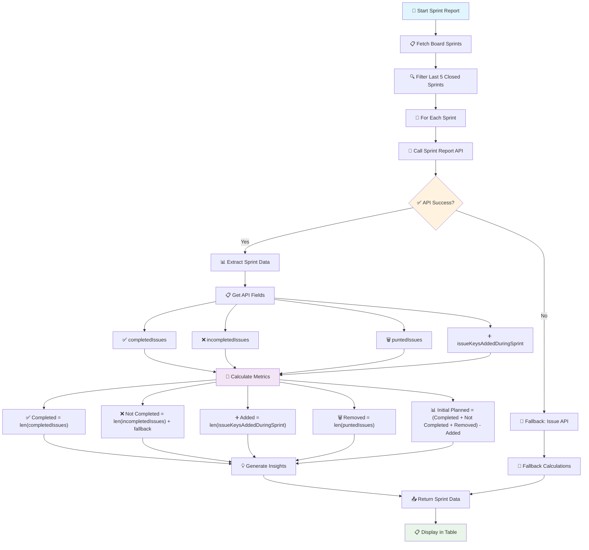
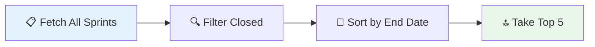

# 📊 Jira Sprint Report Dashboard

> A modern web-based dashboard for generating comprehensive Jira sprint reports and managing labels with advanced analytics.

[](https://python.org)
[](https://flask.palletsprojects.com/)
[](https://developer.atlassian.com/cloud/jira/platform/rest/v3/)

---

## ✨ Features

| Feature | Description | Status |
|---------|-------------|--------|
| 📈 **Sprint Report Web UI** | View last 5 closed sprints with comprehensive metrics | ✅ Active |
| 📊 **Initial Planned Tracking** | Track scope changes and planning accuracy | ✅ Active |
| 📥 **CSV Download** | Export sprint reports for further analysis | ✅ Active |
| 🏷️ **Label Manager** | Modern interface for Jira label management | ✅ Active |
| 📱 **Responsive Design** | Works on desktop and mobile devices | ✅ Active |

### 📋 Sprint Metrics Tracked
- 🎯 **Initial Planned** - Issues planned at sprint start
- ✅ **Completed** - Issues finished successfully  
- ❌ **Not Completed** - Issues not finished
- ➕ **Added During Sprint** - Scope increases
- 🗑️ **Removed During Sprint** - Scope decreases
- 📊 **Completion %** - Success rate
- 💡 **Insights** - AI-generated recommendations

---

## 🚀 Quick Start

### 📋 Prerequisites
- Python 3.7+
- Jira Cloud instance
- Valid Jira API token

### ⚡ Installation

```bash
# 1️⃣ Clone the repository
git clone <your-repo-url>
cd Jira_Tpm

# 2️⃣ Create virtual environment
python3 -m venv venv
source venv/bin/activate  # On Windows: venv\Scripts\activate

# 3️⃣ Install dependencies
pip install -r requirements.txt

# 4️⃣ Configure environment
cp .env.example .env  # Create from template
# Edit .env with your Jira credentials

# 5️⃣ Run the application
python3 app.py
```

### 🔧 Environment Configuration

Create a `.env` file with your Jira credentials:

```env
JIRA_URL=https://your-company.atlassian.net
JIRA_EMAIL=your-email@company.com
JIRA_API_TOKEN=your-api-token-here
```

> 💡 **Tip**: Get your API token from [Atlassian Account Settings](https://id.atlassian.com/manage-profile/security/api-tokens)

---

## 📖 Usage Guide

### 🌐 Web Interface

| Action | Steps |
|--------|-------|
| **📊 Generate Sprint Report** | Sidebar → Sprint Report → Select Board → Generate |
| **📥 Download CSV** | Generate Report → Download CSV button |
| **🏷️ Manage Labels** | Sidebar → Label Manager → Search/Add/Edit/Delete |

### 💻 Command Line

```bash
# Generate sprint report via CLI
python3 scripts/jira_sprint_report.py
```

---

## 📁 Project Structure

```
Jira_Tpm/
├── 📱 app.py                    # Main Flask application
├── 📋 requirements.txt          # Python dependencies
├── 🔐 .env                      # Environment variables (create this)
├── 📂 scripts/
│   ├── 📊 jira_sprint_report.py # Core sprint analysis logic
│   └── 📄 __init__.py
├── 📂 templates/
│   └── 🎨 index.html            # Modern web interface
└── 📖 README.md                 # This file
```

---

## 🧮 Sprint Report Calculation Logic

> **Advanced analytics powered by Jira's native Sprint Report API for maximum accuracy**

### 🔄 Data Sources

| Priority | Source | Accuracy | Usage |
|----------|--------|----------|-------|
| 🥇 **Primary** | Jira Sprint Report API | 🎯 **Highest** | Closed sprints analysis |
| 🥈 **Fallback** | Jira Issue API | ⚠️ **Moderate** | When primary fails |

**API Endpoint**: `/rest/greenhopper/1.0/rapid/charts/sprintreport`

---

### 📊 Sprint Report Flow Diagram

```mermaid
graph TD
    A[Start Sprint Report] --> B[Fetch Board Sprints]
    B --> C[Filter Last 5 Closed Sprints]
    C --> D[For Each Sprint]
    D --> E[Call Sprint Report API]
    E --> F{API Success?}
    F -->|Yes| G[Extract Sprint Data]
    F -->|No| H[Fallback: Issue API]
    
    G --> I[Get API Fields]
    I --> J[completedIssues]
    I --> K[incompletedIssues]
    I --> L[puntedIssues]
    I --> M[issueKeysAddedDuringSprint]
    
    J --> N[Calculate Metrics]
    K --> N
    L --> N
    M --> N
    
    N --> O[Completed = len(completedIssues)]
    N --> P[Not Completed = len(incompletedIssues) + fallback logic]
    N --> Q[Added During Sprint = len(issueKeysAddedDuringSprint)]
    N --> R[Removed During Sprint = len(puntedIssues)]
    N --> S[Initial Planned = (Completed + Not Completed + Removed) - Added]
    
    O --> T[Generate Insights]
    P --> T
    Q --> T
    R --> T
    S --> T
    
    T --> U[Return Sprint Data]
    H --> V[Fallback Calculations]
    V --> U
    U --> W[Display in Table]
```

### 🎨 Enhanced Visual Flow Diagram



---

### 📈 Metric Calculations

#### 🎯 **1. Initial Planned**
```python
initial_planned = (completed + not_completed + removed) - added
```
- **📋 Purpose**: Original sprint commitment tracking
- **🎯 Goal**: Measure scope change impact
- **💡 Insight**: Shows planning accuracy

#### ✅ **2. Completed**
```python
completed = len(completedIssues)
```
- **📊 Source**: Jira Sprint Report API
- **🎯 Logic**: Issues marked done during sprint
- **⚡ Fallback**: Current status check

#### ❌ **3. Not Completed**
```python
not_completed = len(incompletedIssues) + fallback_logic
```
- **📊 Primary**: `incompletedIssues` from API
- **🔄 Fallback**: `issuesNotCompletedInCurrentSprint`
- **🎯 Logic**: Issues in sprint but not finished

#### ➕ **4. Added During Sprint**
```python
added = len(issueKeysAddedDuringSprint)
```
- **📊 Source**: Jira Sprint Report API
- **🎯 Logic**: All issues added mid-sprint
- **📈 Impact**: Scope increase tracking

#### 🗑️ **5. Removed During Sprint**
```python
removed = len(puntedIssues)
```
- **📊 Source**: Jira Sprint Report API
- **🎯 Logic**: Issues removed before sprint end
- **📉 Impact**: Scope decrease tracking

#### 📊 **6. Completion Percentage**
```python
completion_rate = (completed / (completed + not_completed)) × 100
```
- **📈 Format**: `75.0%`
- **⚠️ Edge Case**: `N/A` if no issues

#### 💡 **7. Insights**

| Completion Rate | Insight | Icon |
|----------------|---------|------|
| ≥ 80% | Good velocity | ✅ |
| 50-79% | Moderate delivery rate | ⚠️ |
| < 50% | Low delivery rate | ❌ |

| Scope Change | Insight | Icon |
|-------------|---------|------|
| ≥ 20% | Unstable scope | ⚠️ |
| > 0% | Minor scope changes | ℹ️ |
| 0% | Stable scope | ✅ |

---

### 🗺️ API Field Mapping

| 🔗 Jira API Field | 📊 Our Metric | 📝 Description |
|-------------------|---------------|----------------|
| `completedIssues` | ✅ Completed | Issues finished in sprint |
| `incompletedIssues` | ❌ Not Completed | Issues not finished |
| `puntedIssues` | 🗑️ Removed During Sprint | Issues removed from sprint |
| `issueKeysAddedDuringSprint` | ➕ Added During Sprint | Issues added mid-sprint |

---

### 🔍 Sprint Selection Logic



**Process:**
1. 📡 **Fetch**: Get all sprints via pagination
2. 🔍 **Filter**: Only `state = "closed"` with valid `endDate`
3. 📅 **Sort**: Order by `endDate` (newest first)
4. 🔝 **Select**: Take 5 most recent

---

### ⚡ Performance & Accuracy

| Aspect | Primary Method | Fallback Method |
|--------|---------------|----------------|
| **🎯 Accuracy** | 🟢 **Highest** | 🟡 **Moderate** |
| **⚡ Speed** | 🟢 **Fast** | 🟡 **Slower** |
| **📊 Data Source** | Sprint Report API | Issue API + Status |
| **🕐 Time Accuracy** | Sprint closure time | Current time |

---

## 🔧 Technical Notes

### ✅ **Best Practices**
- 🔐 Secure API token storage in `.env`
- 🎯 Primary API prioritization for accuracy
- 🔄 Graceful fallback handling
- 🐛 Debug logging for troubleshooting

### ⚠️ **Known Limitations**
- 📊 Fallback method uses current status (less accurate)
- 🔍 Status mapping: `["done", "closed", "resolved"]`
- 📈 Requires valid Jira Cloud instance

### 🆘 **Troubleshooting**
- 🔍 Check debug output for API field data
- 🔐 Verify API token permissions
- 📡 Ensure network connectivity to Jira

---

## 🤝 Contributing

We welcome contributions! Please see our contributing guidelines for details.

## 📄 License

This project is licensed under the MIT License - see the LICENSE file for details.

---

<div align="center">

**🚀 Built with ❤️ for better sprint analytics**

[⭐ Star this repo](https://github.com/your-repo) | [🐛 Report Bug](https://github.com/your-repo/issues) | [💡 Request Feature](https://github.com/your-repo/issues)

</div>

