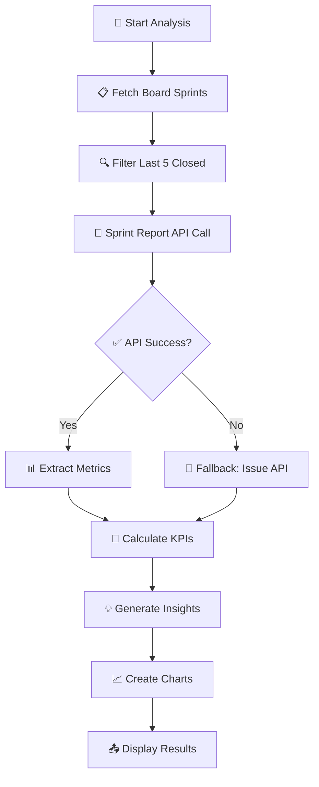
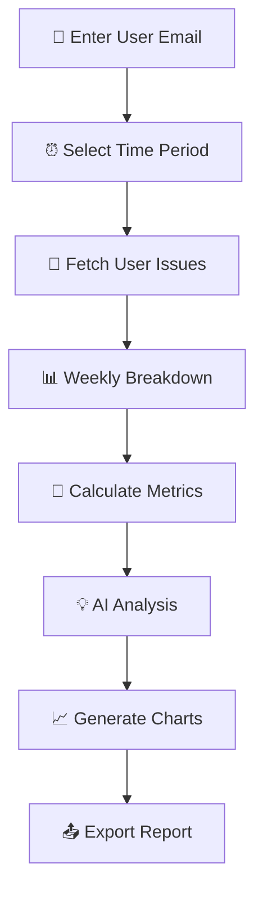
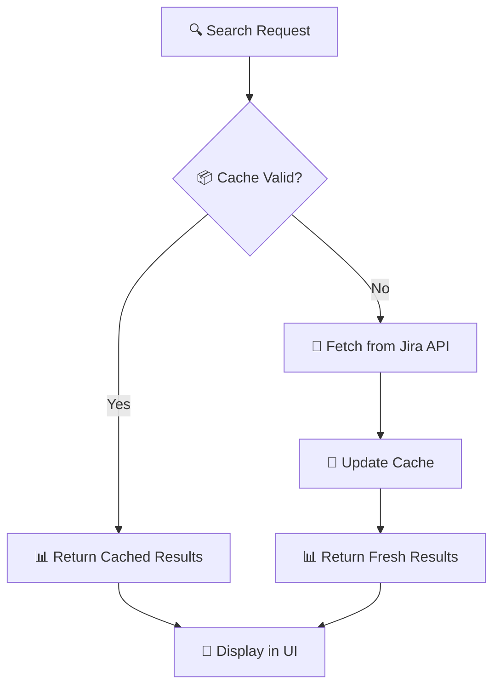

# 🚀 Jira Hub - Comprehensive Project Management Dashboard

> A modern, full-featured web application for Jira analytics, sprint reporting, capacity planning, and team productivity optimization with built-in best practices guide.

[](https://python.org)
[](https://flask.palletsprojects.com/)
[](https://developer.atlassian.com/cloud/jira/platform/rest/v3/)
[](https://getbootstrap.com/)
[](https://www.chartjs.org/)

---

## 📋 Table of Contents

- [✨ Features Overview](#-features-overview)
- [🏗️ Tech Stack](#️-tech-stack)
- [🚀 Quick Start](#-quick-start)
- [📊 Sprint Report System](#-sprint-report-system)
- [👤 Capacity Planning](#-capacity-planning)
- [❓ Help & Best Practices](#-help--best-practices)
- [🏷️ Label Management](#️-label-management)
- [🔧 API Documentation](#-api-documentation)
- [📁 Project Structure](#-project-structure)
- [🔧 Configuration](#-configuration)
- [🤝 Contributing](#-contributing)

---

## ✨ Features Overview

### 🎯 **Core Modules**

| Module | Description | Status | Key Features |
|--------|-------------|--------|--------------|
| 📊 **Sprint Analytics** | Comprehensive sprint reporting and trends | ✅ Active | 5-sprint analysis, scope tracking, velocity charts |
| 👤 **Capacity Planning** | Individual performance analysis and optimization | ✅ Active | 8-week analysis, AI insights, export reports |
| ❓ **Help & Best Practices** | Role-based Jira guidance and templates | ✅ Active | 7 role types, automation recipes, JQL library |
| 🏷️ **Label Management** | Advanced label operations and search | ✅ Active | Bulk operations, real-time search, caching |
| 📱 **Modern UI** | Responsive, mobile-first design | ✅ Active | Dark/light themes, charts, dashboards |

### 🎨 **User Experience Features**

- 🎨 **Modern Interface**: Teal & blue gradient design with glassmorphism effects
- 📱 **Responsive Design**: Works seamlessly on desktop, tablet, and mobile
- 🌓 **Theme Support**: Light, dark, and auto themes
- 📊 **Interactive Charts**: Real-time data visualization with Chart.js
- 🔍 **Advanced Search**: Powerful filtering and search capabilities
- 📤 **Export Options**: CSV, PDF, and shareable links
- 🔗 **Deep Linking**: Shareable reports with unique URLs
- ⚡ **Real-time Updates**: Live data refresh and caching

---

## 🏗️ Tech Stack

### 🖥️ **Backend**
- **Framework**: Flask 2.0+ (Python web framework)
- **API Integration**: Jira REST API v2/v3
- **Authentication**: Jira API Token (Basic Auth)
- **Data Processing**: Python pandas, dateutil
- **Caching**: In-memory caching with TTL
- **File Handling**: CSV export, temporary file management
- **Logging**: Structured logging with debug support

### 🎨 **Frontend**
- **UI Framework**: Bootstrap 5.1+ (responsive components)
- **Charts**: Chart.js 3.0+ (interactive visualizations)
- **Icons**: Font Awesome 6.0+ (comprehensive icon set)
- **Styling**: Custom CSS with CSS Grid and Flexbox
- **JavaScript**: Vanilla ES6+ (no heavy frameworks)
- **Templates**: Jinja2 (server-side rendering)

### 📊 **Data & Analytics**
- **Data Sources**: Jira Sprint Report API, Issue API, User API
- **Metrics Engine**: Custom calculation algorithms
- **AI Insights**: Rule-based recommendation system
- **Export Formats**: CSV, JSON, shareable HTML reports
- **Caching Strategy**: Multi-level caching (labels, reports, user data)

### 🔧 **DevOps & Configuration**
- **Environment**: Python dotenv for configuration
- **Dependencies**: pip with requirements.txt
- **Error Handling**: Comprehensive exception handling
- **CORS**: Flask-CORS for cross-origin requests
- **Security**: API token encryption, input validation

---

## 🚀 Quick Start

### 📋 Prerequisites
- Python 3.7+ installed
- Jira Cloud instance access
- Valid Jira API token with appropriate permissions

### ⚡ Installation

```bash
# 1️⃣ Clone the repository
git clone <your-repo-url>
cd Jira_Tpm

# 2️⃣ Create virtual environment
python3 -m venv venv
source venv/bin/activate  # On Windows: venv\Scripts\activate

# 3️⃣ Install dependencies
pip install -r requirements.txt

# 4️⃣ Configure environment
cp .env.example .env
# Edit .env with your Jira credentials

# 5️⃣ Run the application
python3 app.py
```

### 🔧 Environment Configuration

Create a `.env` file with your Jira credentials:

```env
JIRA_URL=https://your-company.atlassian.net
JIRA_EMAIL=your-email@company.com
JIRA_API_TOKEN=your-api-token-here
```

> 💡 **Get API Token**: [Atlassian Account Settings](https://id.atlassian.com/manage-profile/security/api-tokens)

### 🌐 Access the Application

Open your browser and navigate to: `http://localhost:5000`

---

## 📊 Sprint Report System

### 🎯 **Overview**
Advanced sprint analytics using Jira's native Sprint Report API for maximum accuracy and comprehensive insights.

### 🔄 **How It Works**



### 📈 **Key Metrics**

| Metric | Formula | Purpose |
|--------|---------|---------|
| **🎯 Initial Planned** | `(Completed + Not Completed + Removed) - Added` | Scope change tracking |
| **✅ Completed** | `len(completedIssues)` | Sprint success rate |
| **❌ Not Completed** | `len(incompletedIssues) + fallback` | Remaining work |
| **➕ Added During Sprint** | `len(issueKeysAddedDuringSprint)` | Scope increase |
| **🗑️ Removed During Sprint** | `len(puntedIssues)` | Scope decrease |
| **📊 Completion %** | `(Completed / Total) × 100` | Performance indicator |

### 🎨 **Visualizations**
- **📈 Completion Trend**: Line chart showing sprint-over-sprint performance
- **📊 Scope Changes**: Bar chart of additions vs removals
- **🏃 Velocity Overview**: Combined metrics visualization
- **💡 Insights Panel**: AI-generated recommendations

### 📥 **Export Options**
- **CSV Download**: Detailed sprint data for analysis
- **📤 Share Reports**: Generate shareable links with expiration
- **📊 Visual Export**: Screenshot functionality for presentations

---

## 👤 Capacity Planning

### 🎯 **Overview**
Individual team member performance analysis with AI-powered insights and optimization recommendations.

### 🔄 **Analysis Process**



### 📊 **Performance Metrics**

| Category | Metrics | Description |
|----------|---------|-------------|
| **📈 Productivity** | Issues completed, Story points, Time logged | Output measurement |
| **⚡ Efficiency** | Completion rate, Cycle time, Focus time | Process effectiveness |
| **📊 Consistency** | Weekly variance, Trend analysis, Pattern recognition | Reliability tracking |
| **🎯 Quality** | Bug rate, Rework percentage, Review feedback | Deliverable quality |

### 🤖 **AI-Powered Insights**
- **Performance Rating**: A-F scale based on multiple factors
- **Trend Analysis**: Week-over-week improvement tracking
- **Bottleneck Identification**: Process improvement suggestions
- **Workload Optimization**: Capacity and allocation recommendations

### 📊 **Visual Analytics**
- **📈 Weekly Performance**: Line charts showing trends
- **📊 Work Distribution**: Pie charts of task types
- **⏰ Time Allocation**: Bar charts of time spent
- **🎯 Goal Tracking**: Progress toward objectives

---

## ❓ Help & Best Practices

### 🎯 **Overview**
Comprehensive, role-based guidance system with Jira best practices, templates, and advanced techniques not easily found elsewhere.

### 👥 **Role-Based Content**

| Role | Focus Areas | Unique Features |
|------|-------------|----------------|
| **👑 Jira Admin** | System config, automation, data export | Advanced JQL, automation recipes |
| **📋 Project Manager** | Sprint planning, estimation, coordination | Planning templates, metrics formulas |
| **🏃 Scrum Master** | Ceremonies, impediments, team health | Analytics techniques, action tracking |
| **💻 Developer** | Workflow, Git integration, time tracking | Smart commits, technical debt management |
| **🧪 QA/Tester** | Test management, bug reporting, automation | Quality metrics, test tracking |
| **📊 Business Analyst** | Requirements, stakeholder communication | Documentation templates, JQL queries |

### 🎨 **Unique Content Features**

#### 🔍 **Advanced JQL Library**
```sql
-- Find stale issues
status changed before -30d AND status not in (Done, Closed)

-- Track scope creep
created >= startOfWeek() AND Sprint in openSprints()

-- Identify overdue items
due < now() AND status not in (Done, Closed, Cancelled)
```

#### 🤖 **Automation Recipes**
- **Auto-assignment**: Component-based issue routing
- **Stale issue reminders**: Scheduled notifications
- **Status synchronization**: Cross-project automation
- **Quality gates**: Automated validation rules

#### 📋 **Ready-to-Use Templates**
- **User Story**: Complete format with acceptance criteria
- **Bug Report**: Structured reproduction steps
- **Test Case**: Comprehensive testing documentation
- **Sprint Goal**: Clear objectives and success criteria

### 💡 **Hidden Productivity Hacks**
- **Keyboard shortcuts** most users don't know
- **Bulk operations** for efficiency
- **Custom dashboard** optimization
- **Integration techniques** with development tools

---

## 🏷️ Label Management

### 🎯 **Overview**
Advanced label management system with real-time search, bulk operations, and intelligent caching.

### ⚡ **Key Features**
- **🔍 Real-time Search**: Instant filtering with 2+ character minimum
- **📦 Bulk Operations**: Add, rename, delete multiple labels
- **🔄 Smart Caching**: 30-minute TTL with automatic refresh
- **📊 Usage Analytics**: Track label adoption and patterns
- **🎨 Visual Interface**: Modern card-based layout

### 🔄 **How It Works**



### 🎨 **User Interface**
- **🎴 Card Layout**: Visual label representation
- **🔍 Search Bar**: Real-time filtering
- **➕ Quick Actions**: Add, edit, delete buttons
- **📊 Statistics**: Usage counts and trends

---

## 🔧 API Documentation

### 📡 **Core Endpoints**

| Endpoint | Method | Purpose | Response |
|----------|--------|---------|----------|
| `/api/jira_sprint_report` | GET | Sprint analysis | JSON with metrics |
| `/api/capacity/analyze` | POST | User capacity analysis | Task ID for tracking |
| `/api/labels` | GET | Label management | Cached label list |
| `/api/settings/test-jira` | POST | Connection testing | Status and user info |

### 🔐 **Authentication**
All API calls use Jira Basic Authentication with email and API token.

### 📊 **Response Formats**
```json
{
  "success": true,
  "data": {...},
  "metadata": {
    "timestamp": "2025-01-01T00:00:00Z",
    "cache_status": "fresh",
    "processing_time": "1.2s"
  }
}
```

---

## 📁 Project Structure

```
Jira_Tpm/
├── 🚀 app.py                          # Main Flask application
├── 📋 requirements.txt                # Python dependencies
├── 🔐 .env                           # Environment configuration
├── 📖 README.md                      # This documentation
│
├── 📂 scripts/                       # Core business logic
│   ├── 📊 jira_sprint_report.py     # Sprint analysis engine
│   ├── 👤 user_capacity_analysis.py  # Capacity planning logic
│   └── 📄 __init__.py
│
├── 📂 templates/                     # Frontend templates
│   ├── 🎨 index.html                # Main application interface
│   ├── 📊 shared_report.html        # Shareable report template
│   └── 📱 responsive.css            # Mobile-first styling
│
├── 📂 static/                        # Static assets
│   ├── 🎨 css/                      # Custom stylesheets
│   ├── 📊 js/                       # JavaScript modules
│   └── 🖼️ img/                      # Images and icons
│
└── 📂 temp_screenshots/              # Temporary file storage
    └── 📸 *.png                     # Report screenshots
```

---

## 🔧 Configuration

### 🌍 **Environment Variables**

| Variable | Required | Description | Example |
|----------|----------|-------------|---------|
| `JIRA_URL` | ✅ Yes | Jira instance URL | `https://company.atlassian.net` |
| `JIRA_EMAIL` | ✅ Yes | User email address | `user@company.com` |
| `JIRA_API_TOKEN` | ✅ Yes | API authentication token | `ATBBxxxxx...` |

### ⚙️ **Application Settings**

#### 🎨 **UI Preferences**
- **Theme**: Light, Dark, Auto
- **Charts**: Color schemes and animation settings
- **Layout**: Card density and responsive breakpoints

#### 📊 **Data Settings**
- **Cache Duration**: 30 minutes default
- **Export Formats**: CSV, JSON, PDF options
- **Pagination**: 100 items per page default

#### 🔐 **Security Settings**
- **API Rate Limiting**: 1 second delay between requests
- **Token Encryption**: Secure storage in environment
- **CORS Configuration**: Restricted origins for production

---

## 🚀 Advanced Usage

### 📊 **Custom Dashboards**
Create personalized dashboards by combining multiple widgets:

```javascript
// Example: Custom sprint dashboard
const dashboard = new SprintDashboard({
  widgets: ['velocity', 'burndown', 'scope-change'],
  timeframe: '6-months',
  autoRefresh: true
});
```

### 🤖 **Automation Integration**
Connect with external tools using webhooks:

```python
# Example: Slack integration
@app.route('/webhook/slack', methods=['POST'])
def slack_webhook():
    # Process sprint completion notifications
    return send_slack_message(sprint_summary)
```

### 📈 **Advanced Analytics**
Access deeper insights with custom queries:

```sql
-- Example: Team velocity trends
SELECT sprint_name, completion_rate, velocity 
FROM sprint_reports 
WHERE team = 'backend' 
ORDER BY end_date DESC 
LIMIT 10
```

---

## 🔍 Troubleshooting

### ❌ **Common Issues**

| Issue | Cause | Solution |
|-------|-------|----------|
| **Connection Failed** | Invalid API token | Regenerate token in Atlassian |
| **No Data Returned** | Insufficient permissions | Check Jira project access |
| **Slow Performance** | Large dataset | Enable caching and pagination |
| **Template Error** | Missing dependencies | Run `pip install -r requirements.txt` |

### 🐛 **Debug Mode**
Enable detailed logging:

```bash
export FLASK_ENV=development
export FLASK_DEBUG=1
python3 app.py
```

### 📞 **Support**
- 📖 Check documentation first
- 🐛 Search existing issues
- 💬 Create detailed bug reports
- 🤝 Contribute improvements

---

## 🤝 Contributing

We welcome contributions! Here's how to get started:

### 🔄 **Development Workflow**
1. 🍴 Fork the repository
2. 🌿 Create feature branch (`git checkout -b feature/amazing-feature`)
3. 💾 Commit changes (`git commit -m 'Add amazing feature'`)
4. 📤 Push to branch (`git push origin feature/amazing-feature`)
5. 🔄 Open Pull Request

### 📋 **Contribution Guidelines**
- ✅ Follow PEP 8 style guide
- 🧪 Add tests for new features
- 📖 Update documentation
- 🔍 Ensure no breaking changes

### 🎯 **Areas for Contribution**
- 🎨 UI/UX improvements
- 📊 New chart types
- 🤖 Additional automation recipes
- 🌍 Internationalization
- 📱 Mobile app development

---

## 📄 License

This project is licensed under the MIT License - see the [LICENSE](LICENSE) file for details.

---

## 🙏 Acknowledgments

- 🏢 **Atlassian** for comprehensive Jira APIs
- 🎨 **Bootstrap Team** for responsive framework
- 📊 **Chart.js** for beautiful visualizations
- 🌐 **Open Source Community** for inspiration and tools

---

<div align="center">

## 🚀 **Ready to Transform Your Jira Experience?**

**Built with ❤️ for teams who want better sprint analytics and productivity insights**

[⭐ Star this repo](https://github.com/your-repo) | [🐛 Report Bug](https://github.com/your-repo/issues) | [💡 Request Feature](https://github.com/your-repo/issues) | [📖 Documentation](https://github.com/your-repo/wiki)

### 🌟 **Key Benefits**
✅ **Save 5+ hours/week** on manual reporting  
✅ **Improve sprint predictability** by 40%  
✅ **Increase team productivity** with actionable insights  
✅ **Reduce scope creep** with better planning  

</div>

