# 🚀 Spark - Comprehensive Project Management Dashboard

> A modern, full-featured web application for Jira analytics, sprint reporting, capacity planning, and team productivity optimization with built-in best practices guide.

[](https://python.org)
[](https://flask.palletsprojects.com/)
[](https://developer.atlassian.com/cloud/jira/platform/rest/v3/)
[](https://getbootstrap.com/)
[](https://www.chartjs.org/)

---

## 📋 Table of Contents

- [✨ Features Overview](#-features-overview)
- [🏗️ Tech Stack](#️-tech-stack)
- [🚀 Quick Start](#-quick-start)
- [🐳 Docker Deployment](#-docker-deployment)
- [📊 Sprint Report System](#-sprint-report-system)
- [👤 Capacity Planning](#-capacity-planning)
- [❓ Help & Best Practices](#-help--best-practices)
- [🏷️ Label Management](#️-label-management)
- [🔧 API Documentation](#-api-documentation)
- [📁 Project Structure](#-project-structure)
- [🔧 Configuration](#-configuration)
- [🤝 Contributing](#-contributing)

---

## ✨ Features Overview

### 🎯 **Core Modules**

| Module | Description | Status | Key Features |
|--------|-------------|--------|--------------|
| 📊 **Sprint Analytics** | Comprehensive sprint reporting and trends | ✅ Active | 5-sprint analysis, scope tracking, velocity charts |
| 👤 **Capacity Planning** | Individual performance analysis and optimization | ✅ Active | 8-week analysis, AI insights, export reports |
| ❓ **Help & Best Practices** | Role-based Jira guidance and templates | ✅ Active | 7 role types, automation recipes, JQL library |
| 🏷️ **Label Management** | Advanced label operations and search | ✅ Active | Bulk operations, real-time search, caching |
| 📱 **Modern UI** | Responsive, mobile-first design | ✅ Active | Dark/light themes, charts, dashboards |

### 🎨 **User Experience Features**

- 🎨 **Modern Interface**: Teal & blue gradient design with glassmorphism effects
- 📱 **Responsive Design**: Works seamlessly on desktop, tablet, and mobile
- 🌓 **Theme Support**: Light, dark, and auto themes
- 📊 **Interactive Charts**: Real-time data visualization with Chart.js
- 🔍 **Advanced Search**: Powerful filtering and search capabilities
- 📤 **Export Options**: CSV, PDF, and shareable links
- 🔗 **Deep Linking**: Shareable reports with unique URLs
- ⚡ **Real-time Updates**: Live data refresh and caching

---

## 🏗️ Tech Stack

### 🖥️ **Backend**
- **Framework**: Flask 2.0+ (Python web framework)
- **API Integration**: Jira REST API v2/v3
- **Authentication**: Jira API Token (Basic Auth)
- **Data Processing**: Python pandas, dateutil
- **Caching**: In-memory caching with TTL
- **File Handling**: CSV export, temporary file management
- **Logging**: Structured logging with debug support

### 🎨 **Frontend**
- **UI Framework**: React 18+ with Material-UI (modern components)
- **Charts**: Chart.js 3.0+ (interactive visualizations)
- **Icons**: Material-UI Icons (comprehensive icon set)
- **Styling**: Material-UI theming with responsive design

### 🐳 **Deployment**
- **Containerization**: Docker with multi-stage builds
- **Orchestration**: Docker Compose for development and production
- **Frontend Build**: Node.js 18+ for React application
- **Backend Runtime**: Python 3.9+ Alpine Linux
- **Production Server**: Flask with static file serving

### 📊 **Data & Analytics**
- **Data Sources**: Jira Sprint Report API, Issue API, User API
- **Metrics Engine**: Custom calculation algorithms
- **AI Insights**: Rule-based recommendation system
- **Export Formats**: CSV, JSON, shareable HTML reports
- **Caching Strategy**: Multi-level caching (labels, reports, user data)

### 🔧 **DevOps & Configuration**
- **Environment**: Python dotenv for configuration
- **Dependencies**: pip with requirements.txt
- **Error Handling**: Comprehensive exception handling
- **CORS**: Flask-CORS for cross-origin requests
- **Security**: API token encryption, input validation

---

## 📁 Project Structure

The project is organized into clear, logical folders:

```
jira_tpm/
├── 📁 backend/          # Python Flask backend (app.py, scripts, etc.)
├── 📁 frontend/         # React frontend application
├── 📁 config/           # Configuration files and scripts
├── 📁 docs/             # Documentation and guides
├── 📁 data/             # Data storage and databases
└── 🐳 Docker files      # Containerization setup
```

**See [PROJECT_STRUCTURE.md](PROJECT_STRUCTURE.md) for detailed folder organization.**

## 🚀 Quick Start

### 📋 Prerequisites
- Python 3.7+ installed
- Jira Cloud instance access
- Valid Jira API token with appropriate permissions

### ⚡ Installation

```bash
# 1️⃣ Clone the repository
git clone <your-repo-url>
cd Jira_Tpm

# 2️⃣ Create virtual environment
python3 -m venv venv
source venv/bin/activate  # On Windows: venv\Scripts\activate

# 3️⃣ Install dependencies
pip install -r requirements.txt

# 4️⃣ Configure environment
cp .env.example .env
# Edit .env with your Jira credentials

# 5️⃣ Run the application
python3 app.py
```

### 🔧 Environment Configuration

Create a `.env` file with your Jira credentials:

```env
JIRA_URL=https://your-company.atlassian.net
JIRA_EMAIL=your-email@company.com
JIRA_API_TOKEN=your-api-token-here
```

> 💡 **Get API Token**: [Atlassian Account Settings](https://id.atlassian.com/manage-profile/security/api-tokens)

### 🌐 Access the Application

Open your browser and navigate to: `http://localhost:5000`

---

## 🐳 Docker Deployment

### 📋 Prerequisites for Docker
- Docker and Docker Compose installed
- Git repository cloned locally

### 🚀 Quick Docker Deployment

Follow these steps to deploy the application using Docker:

#### Step 1: Navigate to Project Directory
```bash
cd jira_tpm/
```

#### Step 2: Stop Current Containers (if running)
```bash
docker-compose down
```

#### Step 3: Update Code Files
```bash
# Pull latest changes from master
git pull origin master

# Stash any local changes if needed
git stash push -m "Local changes before deployment"
```

#### Step 4: Rebuild and Deploy
```bash
# Build and start the updated application
docker-compose up --build -d
```

#### Step 5: Verify Deployment
```bash
# Check if container is running
docker-compose ps

# View application logs
docker-compose logs

# Test the application
curl http://localhost:8080/
```

### 🌐 Access the Docker Application

- **Port**: 8080
- **Local URL**: `http://localhost:8080`
- **Network URL**: `http://10.82.144.108:8080` (if accessible from network)

### 🔧 Docker Configuration

The application uses a multi-stage Docker build:

1. **Frontend Stage**: Builds the React application with Node.js 18
2. **Backend Stage**: Sets up Python 3.9 environment with Flask
3. **Production Ready**: Serves the built React app through Flask

### 📁 Docker Files Structure

- `Dockerfile` - Multi-stage build configuration
- `docker-compose.yml` - Production deployment
- `docker-compose.dev.yml` - Development environment
- `.dockerignore` - Files to exclude from Docker context

### 🛠️ Troubleshooting Docker Deployment

#### Container Keeps Restarting
```bash
# Check container logs
docker-compose logs

# Common issues:
# - Missing dependencies (check Dockerfile COPY commands)
# - Port conflicts (ensure port 8080 is available)
# - Environment variables not set
# - Missing Python modules (ensure all .py files are copied to container)
```

#### Frontend Not Loading
```bash
# Verify React build was successful
docker-compose logs | grep "build"

# Check if static files are being served
curl http://localhost:8080/static/js/main.*.js
```

#### Backend API Issues
```bash
# Test API endpoints
curl http://localhost:8080/api/labels
curl http://localhost:8080/api/jira/boards_for_track
```

### 🔄 Development vs Production

#### Development Mode
```bash
# Run development environment with hot reload
docker-compose -f docker-compose.dev.yml up --build
```
- Frontend: `http://localhost:3001`
- Backend: `http://localhost:5000`

#### Production Mode
```bash
# Run production environment
docker-compose up --build -d
```
- Application: `http://localhost:8080`

### ✅ Deployment Verification

After successful deployment, you should see:

1. **Container Status**: `docker-compose ps` shows `Up` status
2. **Application Access**: React frontend loads at `http://localhost:8080`
3. **API Endpoints**: Backend APIs respond correctly
4. **Logs**: No error messages in `docker-compose logs`

#### Quick Health Check
```bash
# Test main application
curl http://localhost:8080/ | grep -o "<title>.*</title>"

# Test API endpoints
curl http://localhost:8080/api/labels
curl http://localhost:8080/api/jira/boards_for_track
```

Expected output:
- Main page: `<title>Spark - Sprint Analytics</title>`
- API endpoints: JSON responses or appropriate error messages

---

## 📊 Sprint Report System

### 🎯 **Overview**
Advanced sprint analytics using Jira's native Sprint Report API for maximum accuracy and comprehensive insights.

### 🔄 **How It Works**



```mermaid
graph TD
    A[🚀 Start Analysis] --> B[📋 Fetch Board Sprints]
    B --> C[🔍 Filter Last 5 Closed]
    C --> D[📡 Sprint Report API Call]
    D --> E{✅ API Success?}
    E -->|Yes| F[📊 Extract Metrics]
    E -->|No| G[🔄 Fallback: Issue API]
    F --> H[🧮 Calculate KPIs]
    G --> H
    H --> I[💡 Generate Insights]
    I --> J[📈 Create Charts]
    J --> K[📤 Display Results]
```

### 📈 **Key Metrics**

| Metric | Formula | Purpose |
|--------|---------|---------|
| **🎯 Initial Planned** | `(Completed + Not Completed + Removed) - Added` | Scope change tracking |
| **✅ Completed** | `len(completedIssues)` | Sprint success rate |
| **❌ Not Completed** | `len(incompletedIssues) + fallback` | Remaining work |
| **➕ Added During Sprint** | `len(issueKeysAddedDuringSprint)` | Scope increase |
| **🗑️ Removed During Sprint** | `len(puntedIssues)` | Scope decrease |
| **📊 Completion %** | `(Completed / Total) × 100` | Performance indicator |

### 🎨 **Visualizations**
- **📈 Completion Trend**: Line chart showing sprint-over-sprint performance
- **📊 Scope Changes**: Bar chart of additions vs removals
- **🏃 Velocity Overview**: Combined metrics visualization
- **💡 Insights Panel**: AI-generated recommendations

### 📥 **Export Options**
- **CSV Download**: Detailed sprint data for analysis
- **📤 Share Reports**: Generate shareable links with expiration
- **📊 Visual Export**: Screenshot functionality for presentations

---

## 👤 Capacity Planning

### 🎯 **Overview**
Individual team member performance analysis with AI-powered insights and optimization recommendations.

### 🔄 **Analysis Process**

```mermaid
graph TD
    A[👤 Enter User Email] --> B[⏰ Select Time Period]
    B --> C[📡 Fetch User Issues]
    C --> D[📊 Weekly Breakdown]
    D --> E[🧮 Calculate Metrics]
    E --> F[💡 AI Analysis]
    F --> G[📈 Generate Charts]
    G --> H[📤 Export Report]
```



### 📊 **Performance Metrics**

| Category | Metrics | Description |
|----------|---------|-------------|
| **📈 Productivity** | Issues completed, Story points, Time logged | Output measurement |
| **⚡ Efficiency** | Completion rate, Cycle time, Focus time | Process effectiveness |
| **📊 Consistency** | Weekly variance, Trend analysis, Pattern recognition | Reliability tracking |
| **🎯 Quality** | Bug rate, Rework percentage, Review feedback | Deliverable quality |

### 🤖 **AI-Powered Insights**
- **Performance Rating**: A-F scale based on multiple factors
- **Trend Analysis**: Week-over-week improvement tracking
- **Bottleneck Identification**: Process improvement suggestions
- **Workload Optimization**: Capacity and allocation recommendations

### 📊 **Visual Analytics**
- **📈 Weekly Performance**: Line charts showing trends
- **📊 Work Distribution**: Pie charts of task types
- **⏰ Time Allocation**: Bar charts of time spent
- **🎯 Goal Tracking**: Progress toward objectives

---

## ❓ Help & Best Practices

### 🎯 **Overview**
Comprehensive, role-based guidance system with Jira best practices, templates, and advanced techniques not easily found elsewhere.

### 👥 **Role-Based Content**

| Role | Focus Areas | Unique Features |
|------|-------------|----------------|
| **👑 Jira Admin** | System config, automation, data export | Advanced JQL, automation recipes |
| **📋 Project Manager** | Sprint planning, estimation, coordination | Planning templates, metrics formulas |
| **🏃 Scrum Master** | Ceremonies, impediments, team health | Analytics techniques, action tracking |
| **💻 Developer** | Workflow, Git integration, time tracking | Smart commits, technical debt management |
| **🧪 QA/Tester** | Test management, bug reporting, automation | Quality metrics, test tracking |
| **📊 Business Analyst** | Requirements, stakeholder communication | Documentation templates, JQL queries |

### 🎨 **Unique Content Features**

#### 🔍 **Advanced JQL Library**
```sql
-- Find stale issues
status changed before -30d AND status not in (Done, Closed)

-- Track scope creep
created >= startOfWeek() AND Sprint in openSprints()

-- Identify overdue items
due < now() AND status not in (Done, Closed, Cancelled)
```

#### 🤖 **Automation Recipes**
- **Auto-assignment**: Component-based issue routing
- **Stale issue reminders**: Scheduled notifications
- **Status synchronization**: Cross-project automation
- **Quality gates**: Automated validation rules

#### 📋 **Ready-to-Use Templates**
- **User Story**: Complete format with acceptance criteria
- **Bug Report**: Structured reproduction steps
- **Test Case**: Comprehensive testing documentation
- **Sprint Goal**: Clear objectives and success criteria

### 💡 **Hidden Productivity Hacks**
- **Keyboard shortcuts** most users don't know
- **Bulk operations** for efficiency
- **Custom dashboard** optimization
- **Integration techniques** with development tools

---

## 🏷️ Label Management

### 🎯 **Overview**
Advanced label management system with real-time search, bulk operations, and intelligent caching.

### ⚡ **Key Features**
- **🔍 Real-time Search**: Instant filtering with 2+ character minimum
- **📦 Bulk Operations**: Add, rename, delete multiple labels
- **🔄 Smart Caching**: 30-minute TTL with automatic refresh
- **📊 Usage Analytics**: Track label adoption and patterns
- **🎨 Visual Interface**: Modern card-based layout

### 🔄 **How It Works**



```mermaid
graph TD
    A[🔍 Search Request] --> B{📦 Cache Valid?}
    B -->|Yes| C[📊 Return Cached Results]
    B -->|No| D[📡 Fetch from Jira API]
    D --> E[🔄 Update Cache]
    E --> F[📊 Return Fresh Results]
    C --> G[🎨 Display in UI]
    F --> G
```

### 🎨 **User Interface**
- **🎴 Card Layout**: Visual label representation
- **🔍 Search Bar**: Real-time filtering
- **➕ Quick Actions**: Add, edit, delete buttons
- **📊 Statistics**: Usage counts and trends

---

## 🔧 API Documentation

### 📡 **Core Internal Endpoints**

| Endpoint | Method | Purpose | Response |
|----------|--------|---------|----------|
| `/api/jira_sprint_report` | GET | Sprint analysis (multi-sprint) | JSON with metrics |
| `/api/jira/tracks` | GET | List all Jira projects (tracks) | JSON list of projects |
| `/api/jira/tracks_customfield` | GET | Get custom field context/options | JSON with custom field info |
| `/api/jira/boards_for_track` | GET | Boards for a given track | JSON list of boards |
| `/api/jira/sprints_for_board` | GET | Sprints for a board | JSON list of sprints |
| `/api/jira/sprint_report` | GET | Start async sprint report task | Task ID |
| `/api/jira/sprint_report_progress` | GET | Sprint report task progress | Progress/status/result |
| `/api/jira/all_boards` | GET | List specific boards | JSON list of boards |
| `/api/jira/sprint_trends` | GET | Sprint trends for a board | JSON with trends |
| `/api/jira/sprint_trends_start` | GET | Start async sprint trends task | Task ID |
| `/api/jira/sprint_trends_progress` | GET | Sprint trends task progress | Progress/status/result |
| `/api/labels` | GET | List/search labels | Cached label list |
| `/api/labels/<old_label>` | PUT | Rename a label | Success/error |
| `/api/labels/<label>` | DELETE | Delete a label | Success/error |
| `/api/settings/test-jira` | POST | Test Jira connection | Status/user info |
| `/api/settings/save-jira` | POST | Save Jira config | Success/error |
| `/api/settings/load-jira` | GET | Load Jira config | Masked config |

### 🌐 **External Jira API Endpoints Used**

| Endpoint | Method | Purpose |
|----------|--------|---------|
| `/rest/api/2/project` | GET | List all Jira projects |
| `/rest/api/2/search` | GET | Search issues (JQL) |
| `/rest/api/2/issue/{issueKey}` | GET/PUT | Get/update issue details/labels |
| `/rest/api/2/myself` | GET | Get current user info |
| `/rest/agile/1.0/board` | GET | List boards |
| `/rest/agile/1.0/board/{boardId}/sprint` | GET | List sprints for a board |
| `/rest/agile/1.0/sprint/{sprintId}` | GET | Sprint details |
| `/rest/agile/1.0/sprint/{sprintId}/issue` | GET | Issues in a sprint |
| `/rest/api/3/field/customfield_15428/context` | GET | Custom field context |
| `/rest/api/3/field/customfield_15428/context/{contextId}/option` | GET | Custom field options |

What is Jira REST API v2?
REST API v2 is Jira's primary API for programmatically accessing and manipulating Jira data. It's the second version of their REST API (hence "v2") and provides comprehensive access to:
Example of How It Works
When you use Spark's label management feature, here's what happens behind the scenes:
Spark calls: /rest/api/2/search with a JQL query like project = SCAL AND labels = "some-label"
Jira returns: All issues matching that criteria
Spark then calls: /rest/api/2/issue/{issueKey} to update each issue's labels
Jira updates: The issue with the new label information

> **Note:** All internal endpoints require valid Jira credentials (set in `.env` or via the UI). Most endpoints proxy or aggregate data from the above Jira REST APIs.

### 🔐 **Authentication**
All API calls use Jira Basic Authentication with email and API token.

### 📊 **Response Formats**
```json
{
  "success": true,
  "data": {...},
  "metadata": {
    "timestamp": "2025-01-01T00:00:00Z",
    "cache_status": "fresh",
    "processing_time": "1.2s"
  }
}
```

---

## 📁 Project Structure

```
Jira_Tpm/
├── 🚀 app.py                          # Main Flask application
├── 📋 requirements.txt                # Python dependencies
├── 🔐 .env                           # Environment configuration
├── 📖 README.md                      # This documentation
│
├── 📂 scripts/                       # Core business logic
│   ├── 📊 jira_sprint_report.py     # Sprint analysis engine
│   ├── 👤 user_capacity_analysis.py  # Capacity planning logic
│   └── 📄 __init__.py
│
├── 📂 templates/                     # Frontend templates
│   ├── 🎨 index.html                # Main application interface
│   ├── 📊 shared_report.html        # Shareable report template
│   └── 📱 responsive.css            # Mobile-first styling
│
├── 📂 static/                        # Static assets
│   ├── 🎨 css/                      # Custom stylesheets
│   ├── 📊 js/                       # JavaScript modules
│   └── 🖼️ img/                      # Images and icons
│
└── 📂 temp_screenshots/              # Temporary file storage
    └── 📸 *.png                     # Report screenshots
```

---

## 🔧 Configuration

### 🌍 **Environment Variables**

| Variable | Required | Description | Example |
|----------|----------|-------------|---------|
| `JIRA_URL` | ✅ Yes | Jira instance URL | `https://company.atlassian.net` |
| `JIRA_EMAIL` | ✅ Yes | User email address | `user@company.com` |
| `JIRA_API_TOKEN` | ✅ Yes | API authentication token | `ATBBxxxxx...` |

### ⚙️ **Application Settings**

#### 🎨 **UI Preferences**
- **Theme**: Light, Dark, Auto
- **Charts**: Color schemes and animation settings
- **Layout**: Card density and responsive breakpoints

#### 📊 **Data Settings**
- **Cache Duration**: 30 minutes default
- **Export Formats**: CSV, JSON, PDF options
- **Pagination**: 100 items per page default

#### 🔐 **Security Settings**
- **API Rate Limiting**: 1 second delay between requests
- **Token Encryption**: Secure storage in environment
- **CORS Configuration**: Restricted origins for production

---

## 🚀 Advanced Usage

### 📊 **Custom Dashboards**
Create personalized dashboards by combining multiple widgets:

```javascript
// Example: Custom sprint dashboard
const dashboard = new SprintDashboard({
  widgets: ['velocity', 'burndown', 'scope-change'],
  timeframe: '6-months',
  autoRefresh: true
});
```

### 🤖 **Automation Integration**
Connect with external tools using webhooks:

```python
# Example: Slack integration
@app.route('/webhook/slack', methods=['POST'])
def slack_webhook():
    # Process sprint completion notifications
    return send_slack_message(sprint_summary)
```

### 📈 **Advanced Analytics**
Access deeper insights with custom queries:

```sql
-- Example: Team velocity trends
SELECT sprint_name, completion_rate, velocity 
FROM sprint_reports 
WHERE team = 'backend' 
ORDER BY end_date DESC 
LIMIT 10
```

---

## 🔍 Troubleshooting

### ❌ **Common Issues**

| Issue | Cause | Solution |
|-------|-------|----------|
| **Connection Failed** | Invalid API token | Regenerate token in Atlassian |
| **No Data Returned** | Insufficient permissions | Check Jira project access |
| **Slow Performance** | Large dataset | Enable caching and pagination |
| **Template Error** | Missing dependencies | Run `pip install -r requirements.txt` |

### 🐛 **Debug Mode**
Enable detailed logging:

```bash
export FLASK_ENV=development
export FLASK_DEBUG=1
python3 app.py
```

### 📞 **Support**
- 📖 Check documentation first
- 🐛 Search existing issues
- 💬 Create detailed bug reports
- 🤝 Contribute improvements

---

## 🤝 Contributing

We welcome contributions! Here's how to get started:

### 🔄 **Development Workflow**
1. 🍴 Fork the repository
2. 🌿 Create feature branch (`git checkout -b feature/amazing-feature`)
3. 💾 Commit changes (`git commit -m 'Add amazing feature'`)
4. 📤 Push to branch (`git push origin feature/amazing-feature`)
5. 🔄 Open Pull Request

### 📋 **Contribution Guidelines**
- ✅ Follow PEP 8 style guide
- 🧪 Add tests for new features
- 📖 Update documentation
- 🔍 Ensure no breaking changes

### 🎯 **Areas for Contribution**
- 🎨 UI/UX improvements
- 📊 New chart types
- 🤖 Additional automation recipes
- 🌍 Internationalization
- 📱 Mobile app development

---

## 📄 License

This project is licensed under the MIT License - see the [LICENSE](LICENSE) file for details.

---

## 🙏 Acknowledgments

- 🏢 **Atlassian** for comprehensive Jira APIs
- 🎨 **Bootstrap Team** for responsive framework
- 📊 **Chart.js** for beautiful visualizations
- 🌐 **Open Source Community** for inspiration and tools

---

<div align="center">

## 🚀 **Ready to Transform Your Jira Experience?**

**Built with ❤️ for teams who want better sprint analytics and productivity insights**

[⭐ Star this repo](https://github.com/your-repo) | [🐛 Report Bug](https://github.com/your-repo/issues) | [💡 Request Feature](https://github.com/your-repo/issues) | [📖 Documentation](https://github.com/your-repo/wiki)

### 🌟 **Key Benefits**
✅ **Save 5+ hours/week** on manual reporting  
✅ **Improve sprint predictability** by 40%  
✅ **Increase team productivity** with actionable insights  
✅ **Reduce scope creep** with better planning  

</div>

